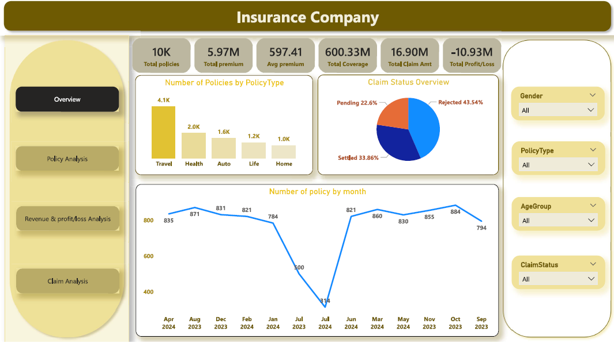

# 📊 Insurance Company | SQL & Power BI Project

## 🧾 Project Overview
This project analyzes insurance business data using **Power BI and SQL** to track policies, claims, revenue, and profitability. The dashboard helps management monitor performance, identify loss-making policy types, and understand customer behavior for better decision-making.

The solution consists of **four interactive dashboard pages**:
1. Overview  
2. Policy Analysis  
3. Revenue & Profit/Loss Analysis  
4. Claim Analysis  
--- 

## 🎯 Business Problem
Insurance companies deal with large volumes of policies and claims. Without proper analytics, it becomes difficult to:

- Track business growth
- Control claim losses
- Identify profitable/loss and risky policy types
- Improve customer targeting
---

## 🛠 Tools & Technologies
- **MySQL** – Data cleaning, transformation, KPI calculation    
- **Power BI** – Dashboard visualization and insights  
- **Excel** – Data validation  

---

## 📂 Dataset Description
The dataset includes:
- CustomerID
- PolicyNumber 
- Age, Gender, AgeGroup  
- PolicyType  
- PremiumAmount  
- CoverageAmount  
- ClaimAmount
- ClaimNumber 
- ClaimStatus  
- PolicyStartDate, PolicyEndDate, ClaimDate  
---

## 🔄 Project Workflow
1. Collected and understood raw insurance data  
2. Cleaned and transformed data using SQL  
3. Created New column (Age group) in Power BI  
4. Built Slicers for Gender, Policy type, Age group, Claim status  
5. Built KPIs using DAX  
6. Designed interactive dashboard in Power BI  

---

## 📈 Dashboard KPIs

- Total Policies
- Total Premium
- Average Premium
- Total Coverage Amount
- Total Claim Amount
- Total Profit / Loss
---

## 📄 Dashboard Pages

### 🟢 1. Overview Dashboard
**Purpose:** Provides a high-level business snapshot.

**Visuals:**
- KPI Cards
- Policies by Policy Type
- Claim Status Distribution
- Monthly Policy Trend

**Insights:**
- Travel insurance has the highest number of policies.
- Rejected claims are higher than settled claims, indicating claim processing challenges.
- Policy count dropped significantly during mid-year, suggesting seasonal or operational impact.

---

### 🟡 2. Policy Analysis Dashboard
**Purpose:** Understand customer segments and policy preferences.

**Visuals:**
- Policies by Age Group & Policy Type
- Claims by Policy Type

**Insights:**
- Senior citizens hold the highest number of policies.
- Travel insurance has the highest number of claims.
- Young adults prefer auto and life insurance policies more than other types.

---

### 🔵 3. Revenue & Profit/Loss Analysis Dashboard
**Purpose:** Analyze revenue generation and financial risk.

**Visuals:**
- Premium vs Claim Amount by Age Group
- Profit/Loss by Policy Type
- Premium vs Claim Amount Comparison

**Insights:**
- Travel insurance shows the highest financial loss.
- Health insurance generates high premiums but also high claim payouts.
- Young adults contribute lower claim amounts compared to middle-aged and senior groups.

---

### 🔴 4. Claim Analysis Dashboard
**Purpose:** Monitor claim behavior and risk trends.

**Visuals:**
- Claims by Age Group
- Average Claim Amount by Policy Type
- Monthly Claim Trend

**Insights:**
- Middle-aged customers file the most claims.
- Health insurance has the highest average claim value.
- Claim volumes fluctuate monthly, indicating seasonal risk patterns.

---

## 🔍 KPIs Key Insights
- 📌 **Total Policies (10K):** Indicates a strong customer base and wide market reach.
- 💰 **Total Premium (5.97M):** Shows healthy revenue generation from insurance policy sales.
- 📈 **Average Premium (597.41):** Reflects moderate customer spending per policy.
- 🛡️ **Total Coverage Amount (600.33M):** Represents high financial exposure and underwriting responsibility.
- 📉 **Total Claim Amount (16.90M):** Highlights significant payout pressure on company finances.
- ⚠️ **Total Profit/Loss (-10.93M):** Business is currently operating at a loss due to high claim volumes.

---

## 📷 Dashboard Preview
(image2.png)(image3.png)(image4.png)

---

## 👤 Author
**Aeiswariya Panigrahi**  
Aspiring Data Analyst | SQL | Python | Power BI  | Excel
📧 Email: aeiswariyapanigrahi@gmail.com 
🔗 LinkedIn: https://www.linkedin.com/in/sushree-aeiswariya-panigrahi-7b8ba022b/  
